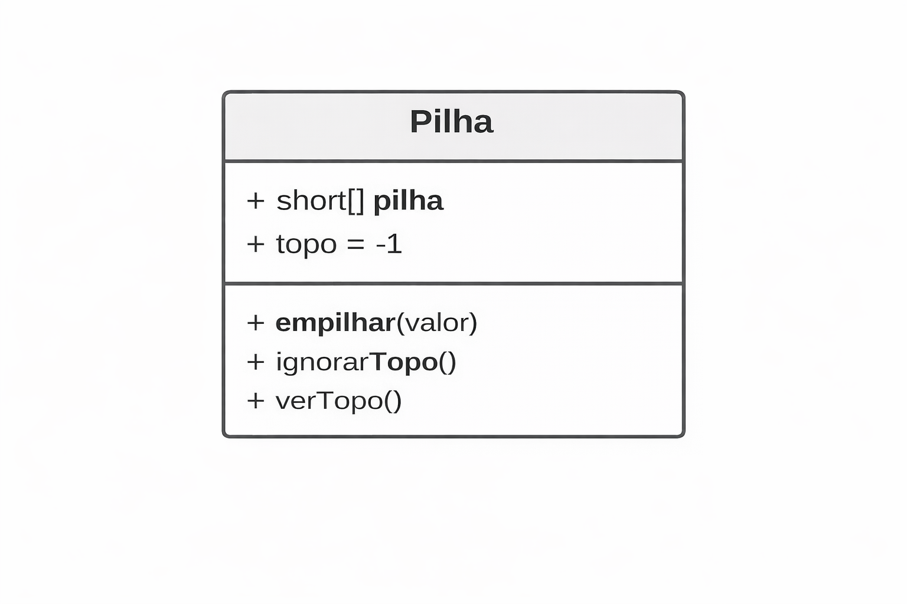

# 📦 Pilhas | STACK  (PT-BR)


---

#🎯 Função principal

A Pilha é uma estrutura de dados linear e estática (nesta implementação), que segue rigorosamente o princípio:

*LIFO — Last In, First Out*
**(O último a entrar é o primeiro a sair)**

Características principais: <br>
⚫ Inserção e remoção ocorrem somente em uma extremidade <br>
⚫ Essa extremidade é chamada de topo <br>
⚫ Não há acesso direto a elementos intermediários <br>
⚫ Toda operação acontece no topo <br>

Exemplo conceitual:
```text
Base
[10]
[20]
[30]  ← Topo
````


#🧠 ONDE OS DADOS DA PILHA FICAM NA MEMÓRIA (JAVA)
##1️⃣ Regras de memória aplicáveis

> - Arrays criados com "new" ficam no HEAP
> - Variáveis primitivas e referências ficam na STACK
> - O array armazena valores, não referências (neste caso short)
