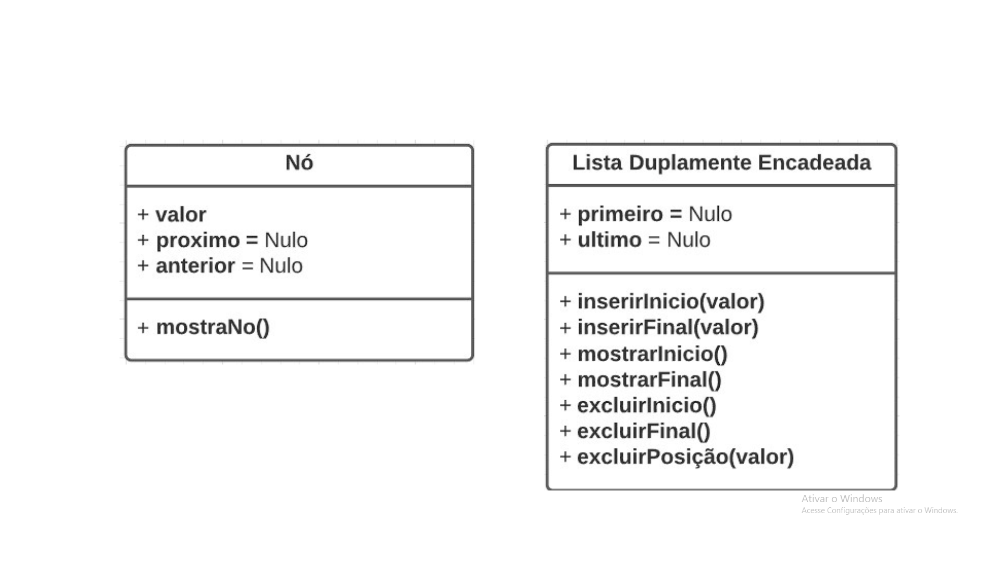
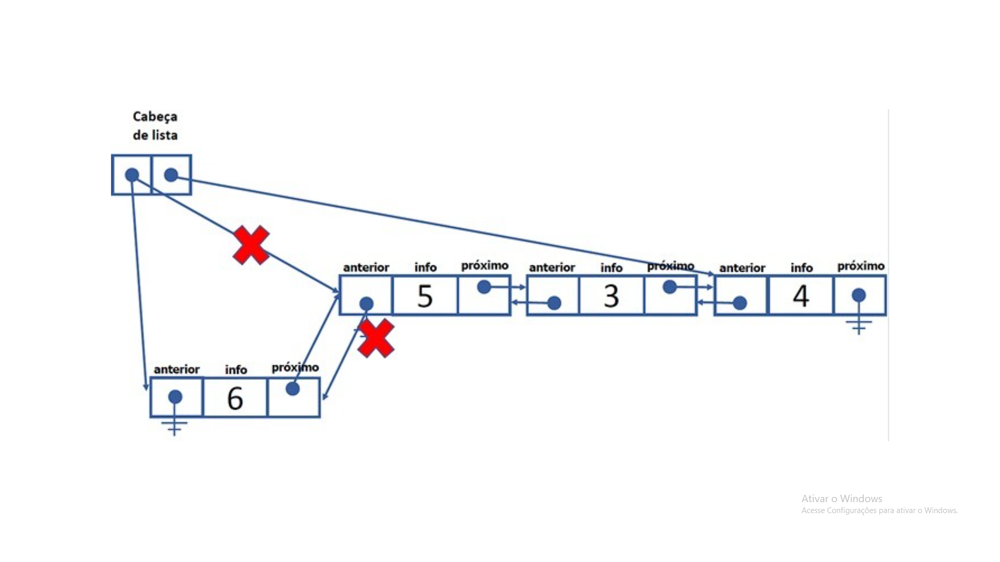
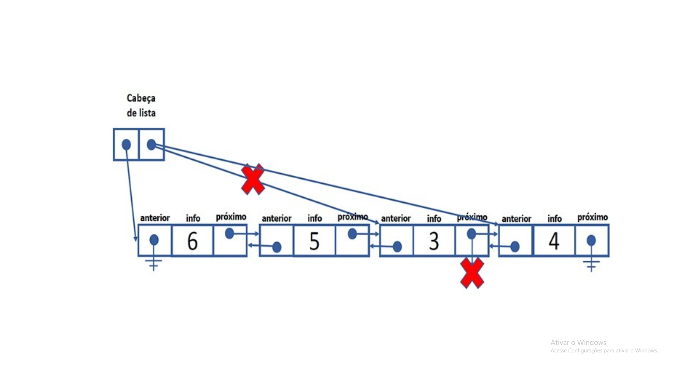
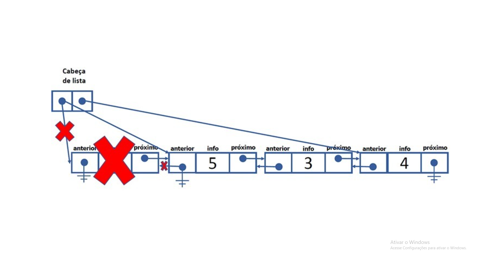
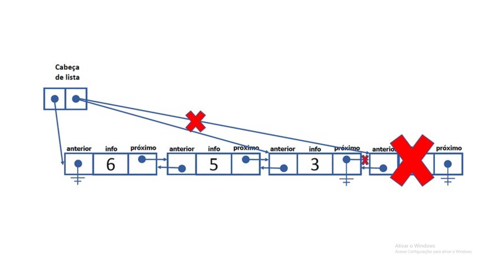
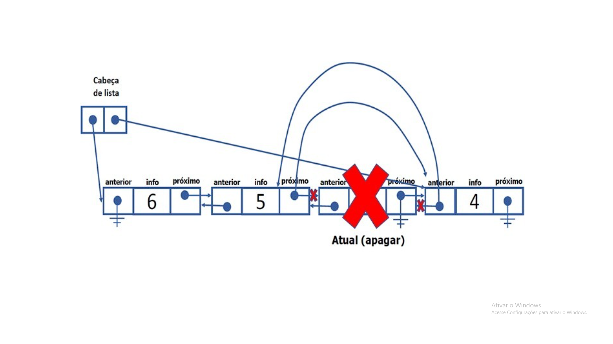
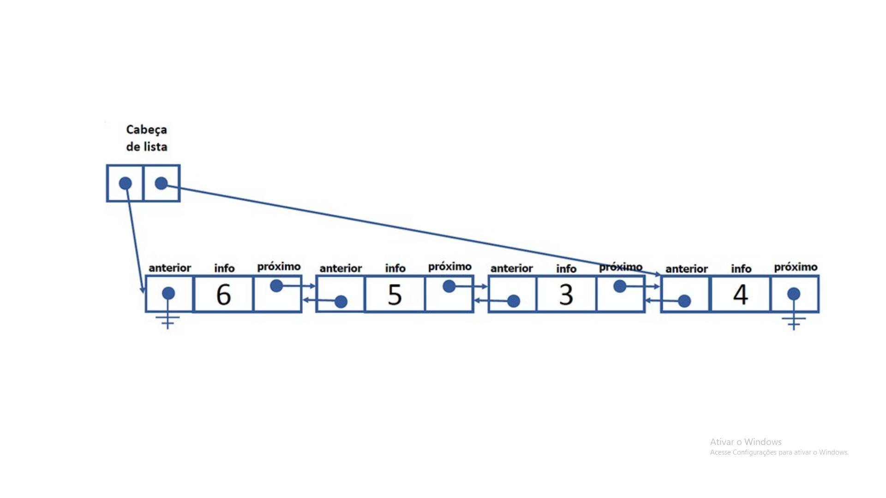

# 📦 Lista Duplamente Encadeada | Doubly Linked List (PT-BR)




---

## 🎯 Função principal

A Lista Encadeada Duplamente é uma estrutura de dados linear, dinâmica e não contígua, caracterizada por:

- Alocação dinâmica no Heap
- Ausência de endereçamento sequencial
- Navegação bidirecional
- Encadeamento explícito por referências

Cada elemento (nó) conhece:

- Quem vem antes
- Quem vem depois

Formalmente, a lista é um grafo linear direcionado em duas direções, com restrições de borda.


---

## 🧠 ONDE OS DADOS DE UMA LISTA ENCADEADA FICAM NA MEMÓRIA (JAVA)

> 1. Regra fundamental de memória em Java
> - Objetos criados com 'new' ficam no HEAP
> - Variáveis locais e referências ficam na STACK
> - Variáveis de tipo objeto não armazenam dados, apenas endereços

> 2. Estado inicial do programa: 
> A lista contém apenas uma referência para o primeiro nó.

> 3. Inserção de nós
> Cada 'new No(valor)' cria um objeto separado no heap.
> A lista aponta apenas para o primeiro.

> 4. Encadeamento: 
> Os nós se conectam por referências (proximo/anterior).
> Não existe armazenamento sequencial.

> 5. Exclusão: 
> Excluir remove referências, não objetos imediatamente.
> O Garbage Collector limpa depois.

> 6. Conceito-chave
> Lista encadeada é uma estrutura lógica baseada em referências.

---

# 🧱 Estrutura básica da lista

### 🔹 Nó (classe `No`)

Cada nó encapsula **três informações**:

- `valor` → dado armazenado
- `proximo` → referência para o próximo nó
- `anterior` → referência para o nó anterior

Representação conceitual:

```text
[ anterior | valor | proximo ]
````
Aspectos técnicos:

- valor representa informação.
- proximo e anterior representam ligações estruturais, não dados.
- A lista é construída exclusivamente por essas referências.


# 🧠 Conceito central: relacionamento bidirecional

Representação de uma lista duplamente encadeada:
```text
null ← [10] ⇄ [20] ⇄ [30] → null
````
Condições de borda:
- Primeiro nó: anterior == null
- Último nó: proximo == null

# 🗣️ Cabeças da lista

O código mantém duas referências externas:
```java
private No primeiro;
private No ultimo;
````

Funções:
primeiro → ponto de entrada da lista
ultimo → ponto de saída da lista

Observação crítica:
> "primeiro" e "ultimo" não são nós, apenas referências.

# ➕ Inserir no início




## Objetivo
Inserir um novo nó antes do atual primeiro.

## Execução lógica

1. Criar o novo nó

2. Se a lista estiver vazia:
   - ultimo também aponta para o novo nó <br>
   
Caso contrário:

   - O antigo primeiro aponta de volta para o novo
   - O novo aponta para o antigo primeiro

3. Atualizar primeiro

Fluxo estrutural:
```text
novo ⇄ antigoPrimeiro
primeiro(Head) → novo
````


# ➕ Inserir no final



## Objetivo
Adicionar um novo nó após o atual ultimo.

## Execução lógica

1. Criar novo nó

2. Se lista vazia:
   - primeiro aponta para ele <br>

Caso contrário:
  - Antigo último aponta para o novo
  - Novo aponta de volta para o antigo último

3. Atualizar ultimo

# ➖ Excluir do início


## Objetivo
Remover o nó apontado por primeiro (Head).

## Execução lógica

1. Guardar o nó removido

2. Se havia apenas um nó:
   - ultimo = null <br>

Caso contrário:
   - O segundo nó perde referência para trás

4. Atualizar "primeiro"

5. Isolar o nó removido

Conceito importante
> O nó não é apagado — ele apenas perde as referências da lista.

# ➖ Excluir do final



## Objetivo

Remover o nó apontado por ultimo (tail).

## Execução lógica

1. Guardar o nó removido

2. Se havia apenas um nó:
   - primeiro = null <br>

Caso contrário:
  - O penúltimo perde referência para frente

3. Atualizar ultimo

4. Isolar o nó removido

# ❌ Excluir qualquer valor


## Objetivo
Remover um nó intermediário sem necessidade de ponteiro auxiliar externo.


1. Percorrer a lista até encontrar o valor

2. Caso não encontre, retornar null

3. Se for o primeiro:
   - Atualizar primeiro <br>

Caso contrário:
  - Ligar anterior ao proximo

4. Se for o último:
   - Atualizar ultimo <br>

Caso contrário: 
   - Ajustar o anterior do próximo nó

5. Isolar o nó removido

Vantagem estrutural
> O próprio nó conhece quem vem antes e depois.

# 🔍 Mostrar do início



Percorre a lista usando "proximo".

## 🔍 Mostrar do final
Percorre a lista usando "anterior".


# 🔎 Pesquisar valor

Funcionamento:

- Percorre a lista do início

- Compara valores

- Retorna o nó ou null

Observação:
Mesmo com lista dupla, a busca continua sequencial.

---

# 👁️  ESQUEMA VISUAL — LISTA DUPLAMENTE ENCADEADA NA MEMÓRIA (JAVA)

CRIAÇÃO DA LISTA <br>

Código: <br>

ListaEncadeadaDuplamente lista = new ListaEncadeadaDuplamente(); <br>

Stack: <br>

lista ───────────────► referência 0x100 <br>

Heap: <br>

0x100 → ListaEncadeadaDuplamente { <br>
primeiro = null <br>
ultimo = null <br>
} <br>

lista.inserirInicio((short) 10) <br>

Stack: <br>

lista ───────────────► 0x100 <br>

Heap: <br>

0x100 → ListaEncadeadaDuplamente { <br>
primeiro ───────► 0x200 <br>
ultimo ───────► 0x200 <br>
} <br>

0x200 → No { <br>
valor = 10 <br>
anterior = null <br>
proximo = null <br>
} <br>

OBS: <br>

Primeiro e último apontam para o mesmo nó. <br>
Lista com apenas um elemento. <br>

lista.inserirInicio((short) 20) <br>

Stack: <br>

lista ───────────────► 0x100 <br>

Heap: <br>

0x100 → ListaEncadeadaDuplamente { <br>
primeiro ───────► 0x300 <br>
ultimo ───────► 0x200 <br>
} <br>

0x300 → No { <br>
valor = 20 <br>
anterior = null <br>
proximo ───────► 0x200 <br>
} <br>

0x200 → No { <br>
valor = 10 <br>
anterior ───────► 0x300 <br>
proximo = null <br>
} <br>

lista.inserirFinal((short) 30) <br>

Stack: <br>

lista ───────────────► 0x100 <br>

Heap: <br>

0x100 → ListaEncadeadaDuplamente { <br>
primeiro ───────► 0x300 <br>
ultimo ───────► 0x400 <br>
} <br>

0x300 → No { <br>
valor = 20 <br>
anterior = null <br>
proximo ───────► 0x200 <br>
} <br>

0x200 → No { <br>
valor = 10 <br>
anterior ───────► 0x300 <br>
proximo ───────► 0x400 <br>
} <br>

0x400 → No { <br>
valor = 30 <br>
anterior ───────► 0x200 <br>
proximo = null <br>
} <br>

VISÃO LÓGICA: <br>

null ← [20] ⇄ [10] ⇄ [30] → null <br>

lista.excluirInicio() <br>

ANTES: <br>

primeiro ─► 0x300 ⇄ 0x200 ⇄ 0x400 <br>

DEPOIS: <br>

Stack: <br>

lista ───────────────► 0x100 <br>

Heap: <br>

0x100 → ListaEncadeadaDuplamente { <br>
primeiro ───────► 0x200 <br>
ultimo ───────► 0x400 <br>
} <br>

0x300 → No { <br>
valor = 20 <br>
anterior = null <br>
proximo = null (NÓ DESCONECTADO) <br>
} <br>

0x200 → No { <br>
valor = 10 <br>
anterior = null <br>
proximo ───────► 0x400 <br>
} <br>

0x400 → No { <br>
valor = 30 <br>
anterior ───────► 0x200 <br>
proximo = null <br>
} <br>

OBS: <br>

O nó 0x300 foi removido da lista. <br>
Ele continua no heap, mas está isolado. <br>
Se não houver mais referências, o Garbage Collector poderá removê-lo. <br>

lista.excluirFinal() <br>

ANTES: <br>

primeiro ─► 0x200 ⇄ 0x400 <br>

DEPOIS: <br>

Stack: <br>

lista ───────────────► 0x100 <br>

Heap: <br>

0x100 → ListaEncadeadaDuplamente { <br>
primeiro ───────► 0x200 <br>
ultimo ───────► 0x200 <br>
} <br>

0x400 → No { <br>
valor = 30 <br>
anterior = null <br>
proximo = null (NÓ DESCONECTADO) <br>
} <br>

0x200 → No { <br>
valor = 10 <br>
anterior = null <br>
proximo = null <br>
} <br>

CONCEITOS-CHAVE <br>

A lista NÃO contém os nós fisicamente. <br>

A lista mantém apenas DUAS referências: <br>

primeiro <br>

ultimo <br>

Cada nó contém: <br>

um valor <br>

uma referência para o próximo <br>

uma referência para o anterior <br>

A ordem da lista é definida exclusivamente pelas referências. <br>

Os nós estão espalhados no heap, não em posições contíguas. <br>


---

## 🔗 Relação com outras estruturas

A lista duplamente encadeada é base direta para:

- Deques

- LRU Cache

- Navegação undo/redo

- Gerenciadores de histórico

- Estruturas de sistemas operacionais


