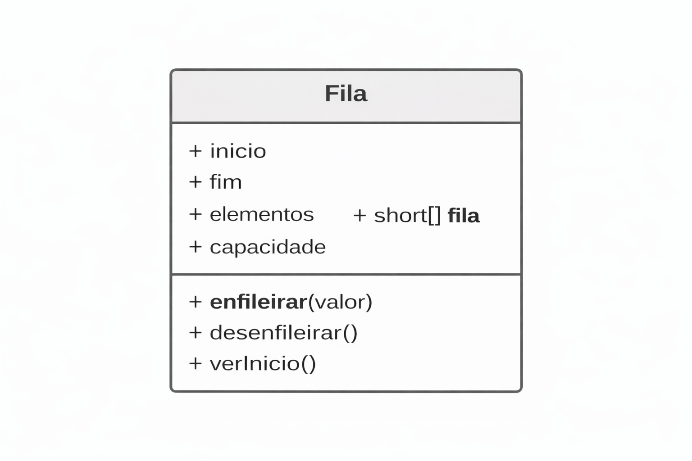

# 📦 Fila (Queue) — Implementação com Vetor Circular (PT-BR)

🎯 Função principal



A Fila é uma estrutura de dados linear e estática (nesta implementação) que segue rigorosamente o princípio:

*FIFO — First In, First Out* <br>
**(O primeiro a entrar é o primeiro a sair)** <br>

Características principais: <br>

- Inserção ocorre no fim <br>
- Remoção ocorre no início <br>
- Não há acesso direto a elementos intermediários <br>
- Ordem de saída preserva a ordem de entrada <br>

```text
Início → [10] [20] [30] ← Fim
````


---

# 🧠 ONDE OS DADOS DA FILA FICAM NA MEMÓRIA (JAVA)
### 1️⃣ Regras de memória aplicáveis

> O array criado com new fica no HEAP
> Variáveis primitivas e referências ficam na STACK
> O array armazena valores primitivos (short)
> A fila cresce e diminui logicamente, não fisicamente

---

# 🧱 Estrutura interna da fila

```java
private short inicio; // Índice do primeiro elemento válido
private short fim; // Índice do último elemento inserido
private short elementos; // Quantidade lógica de elementos
private short capacidade; // Tamanho máximo da fila
private short[] fila; // Array que armazena os valores
````

# ⚙️ Estado inicial da fila

```java
public Fila(short capacidade) {
    this.capacidade = capacidade;
    this.fila = new short[capacidade];
    this.inicio = 0;
    this.fim = -1;
    this.elementos = 0;
}
````
Representação lógica inicial:
```text
fila        = [ ?, ?, ?, ?, ? ]
inicio      = 0
fim         = -1
elementos   = 0
capacidade  = 5
````

## 🗝️ Conceito-chave

> "inicio" e "fim" não indicam posições fixas. <br>
> Eles se movem conforme a fila cresce e diminui

---

# ➕ Enfileirar (enqueue)

```java
private void enfileirar(short valor) {

    if (cheia()) {
        System.out.println("Fila cheia");
        return;
    }

    if (fim == capacidade - 1) {
        fim = -1;
    }

    fim++;
    fila[fim] = valor;
    elementos++;
}

````

Execução passo a passo: <br>

1. Verifica se a fila está cheia <br>
2. Se "fim" chegou ao final do array, volta para -1 (Fila circular) <br>
3. Incrementa fim <br>
4. Insere o valor <br>
5. Incrementa o contador lógico <br>

```java
enfileirar(10);
enfileirar(20);
enfileirar(30);
````

Estado da memória:

```text
fila      = [10, 20, 30, ?, ?]
inicio    = 0
fim       = 2
elementos = 3
````

# ➖ Desenfileirar (dequeue)

```java
private short desenfileirar() {

    if (vazia()) {
        System.out.println("Fila vazia");
        return -1;
    }

    short temp = fila[inicio];
    inicio++;

    if (inicio == capacidade) {
        inicio = 0;
    }

    elementos--;
    return temp;
}

````

O papel da variável "temp" <br>

short temp = fila[inicio]; <br>

- Armazena temporariamente o valor removido <br>
- Permite retornar o valor após ajustar índices <br>
- Não altera fisicamente o array <br>


### Execução passo a passo 

1. Verifica se a fila está vazia <br>
2. Guarda o valor do início em "temp" <br>
3. Avança o índice inicio <br>
4. Aplica circularidade, se necessário (Voltar ao início da fila) <br>
5. Decrementa elementos <br>
6. Retorna o valor removido <br>


```text
fila      = [10, 20, 30, ?, ?]
inicio    = 0
fim       = 2
elementos = 3

````

Após desenfileirar():

```text
fila      = [10, 20, 30, ?, ?]
inicio    = 1
fim       = 2
elementos = 2

````
⚠️ O valor 10 continua no array, mas está fora da fila lógica. (Eventualmente, será sobre-escrito pela circularidade)

# 👁️ Ver início (peek)

```java
private short verInicio() {

    if (vazia()) {
        System.out.println("Fila vazia");
        return -1;
    }
    return fila[inicio];
}

````

Função: <br>

- Apenas consulta <br>
- Não remove nem altera a estrutura <br>
- Retorna o próximo valor a sair <br>

## 🔄 Circularidade da fila
Por que isso é necessário?

Sem circularidade: <br>

- Espaços liberados no início seriam desperdiçados <br>
- A fila pareceria cheia, mesmo não estando <br>

Com circularidade: <br>

- O array é reutilizado <br>
- O início e o fim "dão a volta" <br>

Visualmente: <br>

```text
Índices:   0   1   2   3   4
fila:     [40][50][60][20][30]
            ↑             ↑
          fim           inicio

````

---

# 🧠 ESQUEMA VISUAL — FILA NA MEMÓRIA (JAVA)

Estado inicial

```text
fila      = [ ?, ?, ?, ?, ? ]
inicio    = 0
fim       = -1
elementos = 0


````

enfileirar(10), enfileirar(20), enfileirar(30)

```text
fila      = [10, 20, 30, ?, ?]
inicio    = 0
fim       = 2
elementos = 3


````

desenfileirar()

```text
fila      = [10, 20, 30, ?, ?]
inicio    = 1
fim       = 2
elementos = 2


````

circularidade do fim

```text
fila      = [40, 50, 60, 20, 30]
inicio    = 3
fim       = 2
elementos = 5

````

### 📌 Características finais da fila

- Estrutura FIFO <br>

- Inserção e remoção em O(1) <br>

- Uso eficiente de memória com circularidade <br>

- Não remove valores fisicamente do array <br>

- Controle lógico feito por índices e contador <br>

### 🔗 Relação com outras estruturas

Filas são base para: <br>

- Escalonamento de processos <br>

- Buffers <br>

- Sistemas de impressão <br>

- Filas de requisições <br>

- BFS (Breadth-First Search) <br>

- Sistemas de atendimento <br>

